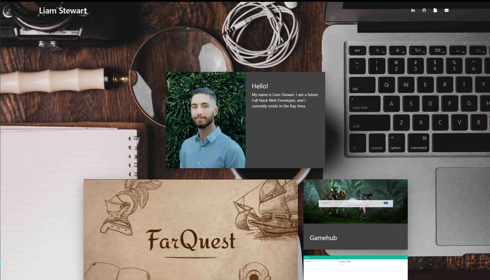

# Portfolio

## Application Photo

## Technologies Used
- Materialize CSS Framework - To design the page.
- Git - Version control system to track changes to source code
- GitHub - Hosts repository that can be deployed to GitHub pages

## Author Links
[LinkedIn](https://www.linkedin.com/in/liamsctewart/) 
[Github](https://github.com/LiamStewart8) 